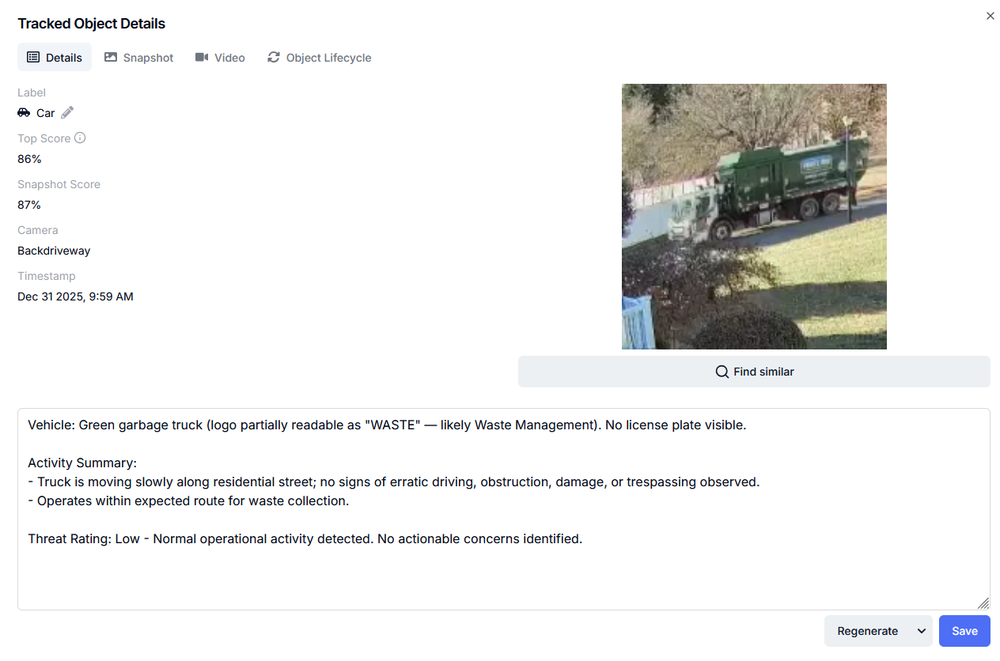
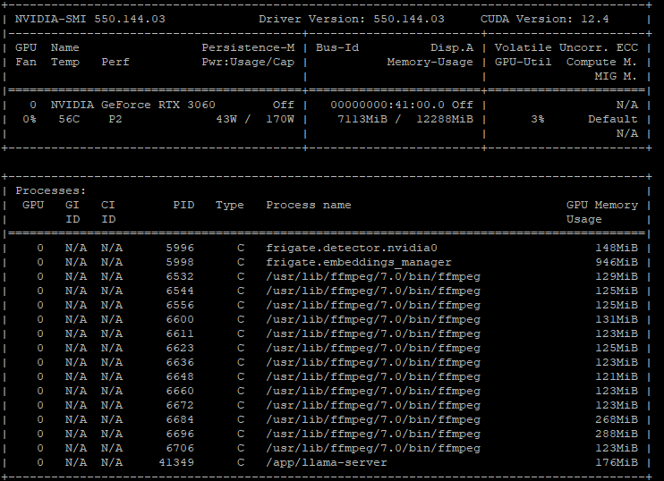

# Frigate + llama.cpp GenAI Deployment Summary

## Overview

This document summarizes a working deployment that combines Frigate NVR with a local GenAI service powered by llama.cpp. Both systems share a single NVIDIA GPU and operate concurrently with low overall utilization.

The GenAI service runs in OpenAI-compatible API mode and is consumed by Frigate for vision-language analysis.

<p align="center">
  
</p>

---

## Hardware Platform

- Host role: NVR + local GenAI inference
- CPU: AMD platform
- System memory: 64 GB RAM
- GPU: NVIDIA GeForce RTX 3060 (12 GB VRAM)
- Operating system: Ubuntu
- NVIDIA driver: 550.144.03
- CUDA version: 12.4

---

## Frigate NVR Configuration

- Frigate version: 0.16.3 (TensorRT build)
- Camera count: 13
- Camera resolution: 2K
- Object detector:
  - ONNX YOLOv9
  - NVIDIA TensorRT acceleration
- Video pipeline:
  - NVIDIA NVDEC (hardware decode)
  - NVIDIA NVENC (hardware encode)
- Embeddings manager: NVIDIA GPU-backed
- Container runtime: Docker with NVIDIA Container Toolkit

### Typical Runtime Utilization

- CPU utilization: ~8%
- GPU utilization: ~7%
- GPU memory usage: ~7.5 GB out of 12 GB

---

## GenAI / Vision-Language Stack

- Inference engine: llama.cpp (CUDA-enabled build)
- API compatibility: OpenAI API (`/v1/chat/completions`)
- Model: Qwen3-VL-4B-Instruct (GGUF, Q4_K_M)
- Vision projector: mmproj-F16.gguf
- Context length: 4096 tokens
- Parallel inference slots: 4
- Batching enabled for improved GPU utilization

### llama.cpp Runtime Characteristics

- CUDA backend successfully loaded and active
- Unified CUDA memory enabled to allow coexistence with Frigate
- GPU layer offload enabled
- Parallelism allows limited concurrent requests
- llama.cpp does not implement a true request queue
- Vision-language inference is significantly more resource-intensive than text-only inference

---

## NVIDIA GPU State (Representative)

NVIDIA-SMI snapshot:
<p align="center">
  
</p>


Active GPU processes include:

- frigate.detector.nvidia0
- frigate.embeddings_manager
- Multiple ffmpeg NVDEC/NVENC processes (one per camera stream)
- /app/llama-server (llama.cpp)

---

## Frigate docker-compose.yaml:

Notes:

- Use the DNS hostname or LAN IP address for the OPENAI_BASE_URL.  In my case it's "frigate-nvr.home".
- Use the exact OPENAI_BASE_URL structure I show and don't use https:
- You must use the -tensorrt version to use nvidia detection

```yaml
services:
  frigate:
    container_name: frigate
    privileged: true
    restart: unless-stopped
    image: ghcr.io/blakeblackshear/frigate:0.16.3-tensorrt
    shm_size: "1024mb"
    gpus: "all"
    devices:
      - /dev/dri/renderD128
      - /dev/nvidia-uvm:/dev/nvidia-uvm
      - /dev/nvidia-uvm-tools:/dev/nvidia-uvm-tools
      - /dev/nvidia0:/dev/nvidia0
    volumes:
      - /etc/localtime:/etc/localtime:ro
      - ./config:/config
      - ./video:/media/frigate
      - ./labelmap:/labelmap
      - type: tmpfs
        target: /tmp/cache
        tmpfs:
          size: 2000000000
    ports:
      - "5000:5000"
      - "443:8971"
      - "8554:8554"
      - "8555:8555/tcp"
      - "8555:8555/udp"
    environment:
      FRIGATE_RTSP_PASSWORD: "admin"
      NVIDIA_VISIBLE_DEVICES: "all"
      NVIDIA_DRIVER_CAPABILITIES: "compute,video,utility"
      OPENAI_BASE_URL: http://frigate-nvr.home:8080/v1
```

----

## Frigate Config.yaml Detector Section

- You'll need the yolov9-t.onnx model, or something similar.
- You can also use Frigate+ models for onnx.

```
detectors:
  nvidia0:
    type: onnx
model:
  path: /config/model_cache/yolov9-t.onnx
  model_type: yolo-generic
  width: 320
  height: 320
  input_tensor: nchw
  input_dtype: float
```

---
## Frigate Config.yaml Genai Section


```
genai:
  enabled: True
  provider: openai
  api_key: "123456"
  model: Qwen3-VL-4B-Instruct-Q4_K_M.gguf
  prompt: >
    You are a professional security analyst reviewing still frames from the {camera}
    security camera.
    Provide a short, factual summary (one sentence) of the {label}'s behavior focusing
    on security relevance.
    Ignore obvious or routine actions such as walking or standing.
    Highlight only potential security concerns such as concealment, handling of objects,
    possible weapons, loitering, forced entry attempts, or behavior inconsistent with normal 
    activity.  However, not every scene is a potential threat or crime scenario.  
    Pay attention to the background, is it residential, wooded,
    industrial, commercial, military?  Adjust the threat posture based upon the camera
    label and background (a camera labeled
    "den" might have a higher threat profile than "driveway").  If a pistol or rifle is observed,
    always remark about it.
    If nothing unusual is observed, simply state "No suspicious activity detected."
    Conclude each response with a clear threat rating on a new line using one of these
    categories:
    "Threat Level: Low", "Threat Level: Medium", or "Threat Level: High".
    Base the threat rating on visible indicators of risk or intent.
    Avoid describing scenery, colors, or lighting.  KEEP COMMENTS SHORT!

  object_prompts:
    person: >
      Evaluate the person for signs of suspicious or threatening behavior.
      Mention only meaningful actions — violent actions, violent or aggressive stance,
      obvious aggressive facial expressions like shouting, handling tools or weapons,
      loitering, or acting covertly.
      Do not state direction or posture unless it implies risk. If available, describe
      the person's gender, approximate age, hair color, skin color, clothing color
      if known, but do not guess.
      Keep the summary to one sentence and end with a threat rating.

    car: >
      Evaluate the vehicle activity in a security context.  Note car make, model and
      color if known, but do not guess.
      Mention only behavior suggesting potential concern, parked in grass,
      damaged or wrecked, blocking access, or being parked near restricted zones.
      Read and include identifiers in summary (license plate, logo) only if clearly
      visible.
      Keep it brief and end with a threat rating.

    animal: >
      Only comment on animals outside. Note whether the animal is likely to cause
      false alarms or intrude in a sensitive area. Small animals
      like cats and birds would not be a threat; dogs, bears, or predators might be.  If
      a person appears to be
      walking a dog, note if the dog is on a leash or not.
      Keep it brief and add a threat rating.

    unknown: >
      Summarize the object or subject only if it presents potential security relevance.  Avoid
      guessing. End with a threat rating.

```
---

## llama.cpp docker-compose.yaml

```yaml
services:
  llama:
    image: ghcr.io/ggml-org/llama.cpp:server-cuda
    container_name: llama_cpp
    restart: unless-stopped
    ports:
      - "8080:8080"
    volumes:
      - ./models:/models
    runtime: nvidia
    environment:
      - NVIDIA_VISIBLE_DEVICES=all
      - NVIDIA_DRIVER_CAPABILITIES=compute,utility
      - GGML_CUDA_ENABLE_UNIFIED_MEMORY=1
      - LLAMA_VISION_ENABLE_MMSEQ=1
    command: >
      -m /models/Qwen3-VL-4B-Instruct-Q4_K_M.gguf
      --mmproj /models/mmproj-F16.gguf
      --host 0.0.0.0
      --port 8080
      -ngl 99
      -c 4096
      --parallel 4
      -b 1024
      -ub 256
      --temp 0.2
```

---

## Architectural Notes

- Frigate and llama.cpp successfully share a single RTX 3060 GPU.
- Minimum NVIDIA driver 550+ is required for CUDA 12.4 compatibility for the 3060.
- NVIDIA Container Toolkit is mandatory for Docker GPU access.
- llama.cpp parallelism improves throughput but does not replace a real request queue.
- For bursty GenAI workloads, a front-end queue or proxy is recommended.
- The system operates well below hardware limits, leaving significant headroom.
- I tested alot of models and decided to stay with the Qwen3-VL-4B model for it's size and performance.  You can try other quantizations or move to the 8B model, or even other models (llava was just okay) to test yourself, but I saw very little benefit from it.

---
